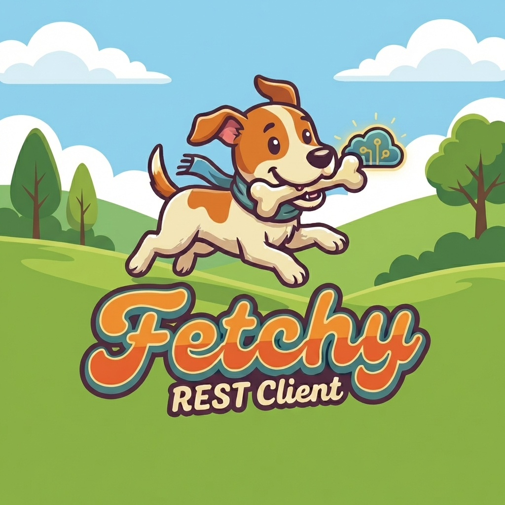

<p align="center">
  
</p>

<h1 align="center">Fetchy</h1>

<p align="center">
  <strong>Local by design. Reliable by nature.</strong>
</p>

<p align="center">
  A powerful, privacy-focused, self-hosted REST API client for developers who value data ownership and offline capabilities.
</p>

<p align="center">
  
  
  
  
</p>

---

## 🔒 Privacy First - Self-Hosted & Offline

**Fetchy is designed with privacy at its core.** Unlike cloud-based alternatives, Fetchy:

- ✅ **100% Self-Hosted** - All your data stays on your machine
- ✅ **No Cloud Sync** - No data ever leaves your computer
- ✅ **No Account Required** - Start using immediately without registration
- ✅ **No Telemetry** - Zero tracking, zero analytics
- ✅ **Works Offline** - Full functionality without internet connection
- ✅ **Local File Storage** - All collections, environments, and history stored locally
- ✅ **Portable** - Move your data wherever you want

**Your API keys, credentials, and request data are YOUR data.** Fetchy ensures complete control over sensitive information.

---

## ✨ Features

### 📡 HTTP Request Management

- **All HTTP Methods** - Support for GET, POST, PUT, PATCH, DELETE, HEAD, and OPTIONS
- **Query Parameters** - Easy-to-use parameter builder with enable/disable toggles
- **Custom Headers** - Add, modify, and toggle request headers
- **Request Body Types**:
  - JSON (with syntax highlighting)
  - Form Data (multipart/form-data)
  - URL Encoded (x-www-form-urlencoded)
  - Raw text
  - Binary file support

### 🔐 Authentication

- **Bearer Token** - JWT and token-based authentication
- **Basic Auth** - Username/password authentication
- **API Key** - Header or query parameter API keys
- **Inheritance** - Collections and folders can define auth that inherits to child requests

### 📁 Collection Management

- **Organized Collections** - Group related requests into collections
- **Nested Folders** - Create hierarchical folder structures
- **Drag & Drop** - Reorder collections, folders, and requests with drag-and-drop
- **Collection Variables** - Define variables scoped to specific collections
- **Collection-Level Auth** - Set authentication at collection or folder level

### 🌍 Environment Variables

- **Multiple Environments** - Create separate environments (Development, Staging, Production)
- **Variable Substitution** - Use `<<variable_name>>` syntax in URLs, headers, and body
- **Secret Variables** - Mark sensitive variables for visual distinction
- **Quick Environment Switching** - Easily switch between environments

### 📊 Response Handling

- **Response Viewer** - View response body with syntax highlighting
- **Response Headers** - Inspect all response headers
- **Request Details** - View the actual request that was sent (with resolved variables)
- **Performance Metrics** - Response time and size information
- **Status Indicators** - Color-coded status codes for quick identification
- **Copy to Clipboard** - Easily copy response data

### 📜 Request History

- **Automatic History** - All sent requests are automatically saved
- **History Browser** - Browse and search through past requests
- **One-Click Restore** - Quickly re-send or restore previous requests
- **Response Cache** - History includes response data for reference

### 🔄 Import & Export

- **Postman Import** - Import collections from Postman (v2.1 format)
- **OpenAPI Import** - Import API specifications from OpenAPI/Swagger (JSON & YAML)
- **cURL Import** - Paste cURL commands to create requests
- **Fetchy Native Format** - Export and import in Fetchy's native JSON format
- **Postman Export** - Export collections to Postman-compatible format

### ⌨️ Keyboard Shortcuts

| Shortcut | Action |
|----------|--------|
| `Ctrl+S` | Save current request |
| `Ctrl+Enter` | Send request |
| `Ctrl+N` | New request |
| `Ctrl+W` | Close current tab |
| `Ctrl+Tab` | Next tab |
| `Ctrl+Shift+Tab` | Previous tab |
| `Ctrl+1-9` | Switch to tab 1-9 |
| `Ctrl+I` | Import collection |
| `Ctrl+E` | Open environments |
| `Ctrl+/` | Show keyboard shortcuts |

### 🎨 User Interface

- **Modern Dark Theme** - Easy on the eyes for long coding sessions
- **Tab-Based Interface** - Work with multiple requests simultaneously
- **Resizable Panels** - Customize your workspace layout
- **Collapsible Sidebar** - Maximize your workspace when needed
- **Syntax Highlighting** - JSON and code highlighting with CodeMirror
- **Variable Highlighting** - Visual indication of defined/undefined variables

### 💾 Data Storage

- **Customizable Home Directory** - Choose where your data is stored
- **Data Migration** - Move your data to a new location with one click
- **JSON Storage** - Human-readable data files
- **Automatic Persistence** - Changes are saved automatically

---

## 🚀 Getting Started

### Prerequisites

- Node.js 18+ 
- npm or yarn

### Installation

1. **Clone the repository**
   ```bash
   git clone https://github.com/yourusername/fetchy.git
   cd fetchy
   ```

2. **Install dependencies**
   ```bash
   npm install
   ```

3. **Run in development mode**
   ```bash
   npm run electron:dev
   ```

4. **Build for production**
   ```bash
   npm run electron:build
   ```

### Download

#### Windows Portable
Download the portable version (no installation required):
- 📦 [**Fetchy Portable for Windows**](./portable-binary/Fetchy-Portable.zip)

Simply extract and run - no installation needed!

### Distribution

After building, you'll find the installers in the `release` folder:
- **Windows**: 
  - `Fetchy Setup x.x.x.exe` (NSIS installer)
  - `Fetchy-Portable.zip` (Portable executable - no installation required, found in `portable-binary/`)
- **macOS**: `.dmg` file
- **Linux**: `.AppImage` file

---

## 📖 Usage Guide

### Creating Your First Request

1. Click the **+** button in the sidebar or press `Ctrl+N`
2. Enter your API endpoint URL
3. Select the HTTP method
4. Add headers, parameters, or body as needed
5. Click **Send** or press `Ctrl+Enter`

### Using Environment Variables

1. Open the Environment modal (`Ctrl+E`)
2. Create a new environment
3. Add variables (e.g., `base_url`, `api_key`)
4. Use variables in your requests: `<<base_url>>/api/users`
5. Variables are highlighted in green when defined, yellow when undefined

### Organizing with Collections

1. Create a collection for your project
2. Add folders for different API modules
3. Drag and drop to organize requests
4. Set collection-level auth to apply to all requests

### Importing from Postman

1. Export your collection from Postman (Collection v2.1)
2. In Fetchy, click **Import** or press `Ctrl+I`
3. Select "Postman Collection"
4. Choose your exported file
5. Your collection is now ready to use!

---

## 🛠️ Technology Stack

- **Frontend**: React 18 with TypeScript
- **UI Styling**: Tailwind CSS
- **State Management**: Zustand with persistence
- **Desktop Framework**: Electron
- **Build Tool**: Vite
- **Drag & Drop**: dnd-kit

---

## 📂 Project Structure

```
fetchy/
├── electron/           # Electron main process
│   ├── main.js        # Main process entry
│   └── preload.js     # Preload scripts for IPC
├── src/
│   ├── components/    # React components
│   ├── hooks/         # Custom React hooks
│   ├── store/         # Zustand stores
│   ├── types/         # TypeScript type definitions
│   ├── utils/         # Helper functions
│   ├── App.tsx        # Main application component
│   └── main.tsx       # React entry point
├── build/             # Build resources (icons)
└── public/            # Static assets
```

---

## 🤝 Contributing

Contributions are welcome! Please feel free to submit a Pull Request.

1. Fork the repository
2. Create your feature branch (`git checkout -b feature/AmazingFeature`)
3. Commit your changes (`git commit -m 'Add some AmazingFeature'`)
4. Push to the branch (`git push origin feature/AmazingFeature`)
5. Open a Pull Request

---

## 📋 Roadmap

- [ ] WebSocket support
- [ ] GraphQL support
- [ ] Pre-request and test scripts
- [ ] Response assertions
- [ ] Request chaining
- [ ] Theme customization (Light theme)
- [ ] Request documentation/notes
- [ ] Code generation (cURL, JavaScript, Python, etc.)

---

## 📄 License

This project is licensed under the MIT License - see the [LICENSE](LICENSE) file for details.

---

## 🙏 Acknowledgments

- Inspired by Postman, Insomnia, and Bruno
- Built with love for the developer community
- Icons from Lucide React

---

<p align="center">
  <strong>Fetchy</strong> - Because your API data should stay yours.
</p>

<p align="center">
  Made with ❤️ for developers who care about privacy
</p>

